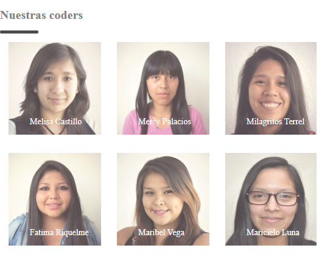

### Nuestras Coders

## Objetivo

El objetivo de esta pagina es crear un galeria de fotos de las coders de laboratoria, esto lo haremos utilizando overflow,pseudo-clases y pseudo-elementos.

## Herramientas Utilizadas

- html , para la estructura del contenido.
- css , para darle estilo al contenido.

## Archivos

- index.html = contiene la estructura de la galería.
- main.css = contiene el estilo que se aplicará a la estructura HTML.

## Html

- estructura básica
- enlace con: archivo de estilo css (main.css)
- enlace con: archivo de funcionalidad javascript (app.js) el cual se puede implementar a solicitud.

## Css

- uso de div: como contenedor de la tabla e imagenes y así darle un estilo a sus hijos.

- uso de table: para dar estilo y dirección a las fotos de nuestras coders.

- uso de img: para dar un margen y opacidad segun lo que nos pida el ejercicio.

- uso de span: para dar estilo a los nombres de las coders .

- uso de pseudoclase: usaremos "hover" para cambiar el tamaño de la iamgen cuando pase el cursor.

- uso de pseudoelementos: usaremos "-webkit-scrollbar", esto para darle stilo, alto y color al scrollbar. 

## Imagen
